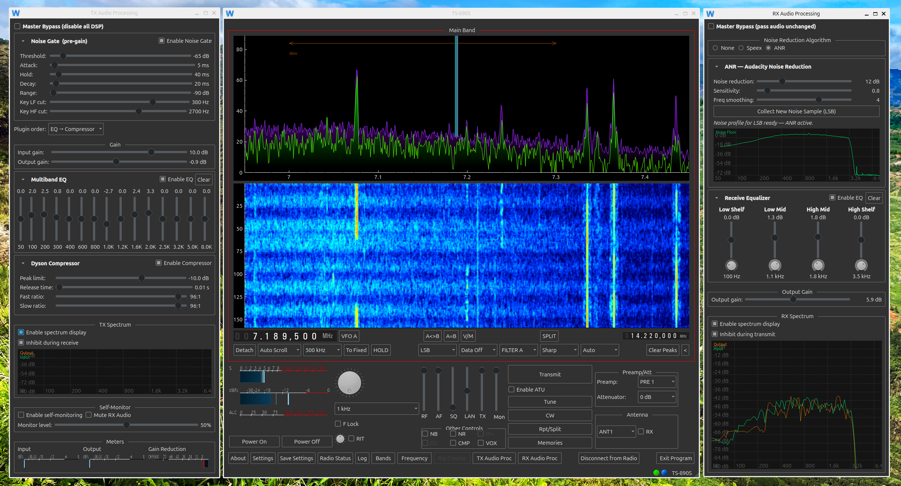

# wfview

[wfview](https://gitlab.com/eliggett/wfview) is an open-soure Ham Radio control application, serving both modern SDR and SDR-hybrid type radios as well as a variety of older radios. Wfview supports modern Kenwood, Icom, and Yaesu radios, and runs on Linux, macOS, and Windows operating systems.

website - [WFVIEW](https://wfview.org/) wfview.org

source code: [gitlab](https://gitlab.com/eliggett/wfview/)

**For screenshots, documentation, User FAQ, Programmer FAQ, and more, please [see the project's website, wfview.org](https://wfview.org/).**

Links for Users: 
- [Getting Started](https://wfview.org/wfview-user-manual/getting-started/)
- [FAQ](https://wfview.org/wfview-user-manual/faq/)
- [User Manual](https://wfview.org/wfview-user-manual/)
- [Support Forum](https://forum.wfview.org/)
- [Patreon](https://www.patreon.com/wfview)

Links for Developers: 
- [Developer's Corner](https://wfview.org/developers/)
- [Compiler Script for Debian-based Linux](https://gitlab.com/eliggett/scripts/-/blob/master/fullbuild-wfview.sh)
- [Public Automated Builds](https://wfview.org/developers/)
- [Source Code](https://gitlab.com/eliggett/wfview/)
- [GitHub beta builds (macOS and linux AppImage)](https://github.com/eliggett/wfview/releases)

wfview is copyright 2017-2026 Elliott H. Liggett (W6EL) and Phil Taylor (M0VSE). All rights reserved. wfview source code is licensed via the GNU GPLv3.

## Credits and 3rd party code

Source code and issues managed by Roeland Jansen, PA3MET 

Testing and development mentorship from Jim Nijkamp, PA8E.

Special thanks to Tony Collen, N0RUA/AE0KW (SK), for his work on open890, which was the inspiration for our support of the Kenwood TS-890. 

Special thanks to our translators:
- Siwij Cat TA1YEP (Turkish)
- OK2HAM (Czech)
- JG3HLX (Japanese)
- Dawid SQ6EMM (Polish)
- Jim PA8E (Dutch)
- David Acacio EA3IPX (Spanish)

The developers of wfview wish to thank the many contributions from the wfview community at-large, including ideas, bug reports, and fixes.

Stylesheet qdarkstyle used under MIT license, stored in /usr/share/wfview/stylesheets/. 

Speex Resample library and DSP noise reduction code Copyright 2003-2008 Jean-Marc Valin 

RT Audio, from Gary P. Scavone

Port Audio, from The Port Audio Community

Special thanks to Norbert Varga (HA2NON), Akos Marton (ES1AKOS), and the nonoo/kappanhang team for their initial work on the OEM Icom protocol.

Many thanks to KB3MMW who assisted with the reverse enginering of the Yaesu LAN protocol. Portions of his code which he has released under LGPL/GPL have been integrated within wfview Forum post

The waterfall and spectrum plot graphics use QCustomPlot, from Emanuel Eichhammer

Dyson Compressor (c) 1996, John S. Dyson. Redistribution of the Dyson Compressor requires this copyright notice.

Multiband EQ, "Triple Para EQ" and Gate 1410 processors (c) Steve Harris, GNU/GPL licensed.

PocketFFT is from Martin Reinecke and used under a BSD 3-Clause New or Revised License. It is (c) 2010-2019 Max-Planck-Society and is based on FFT Pack (FORTRAN) which was written by Paul N. Swarztrauber in 1985, and is copyright by the National Center for Atmospheric Research, Boulder, CO

Audacity Noise Reduction algorithm from here is from Dominic Mazzoni, rewritten by Paul Licameli, with modifications for wfview's streaming usage. The license is GNU/GPL.

wfview contains our own implementation of the Hamlib rigctl protocol which uses portions of code from Hamlib, which are Copyright (C) 2000,2001,2002,2003,2004,2005,2006,2007,2008,2009,2010,2011,2012 The Hamlib Group

wfview contains the adpcm-xq audio encoder/decoder - Copyright (c) David Bryant All rights reserved.

Speex copyright notice:
Copyright (C) 2003 Jean-Marc Valin
Redistribution and use in source and binary forms, with or without
modification, are permitted provided that the following conditions
are met:
- Redistributions of source code must retain the above copyright
notice, this list of conditions and the following disclaimer.
- Redistributions in binary form must reproduce the above copyright
notice, this list of conditions and the following disclaimer in the
documentation and/or other materials provided with the distribution.
- Neither the name of the Xiph.org Foundation nor the names of its
contributors may be used to endorse or promote products derived from
this software without specific prior written permission.
THIS SOFTWARE IS PROVIDED BY THE COPYRIGHT HOLDERS AND CONTRIBUTORS
``AS IS'' AND ANY EXPRESS OR IMPLIED WARRANTIES, INCLUDING, BUT NOT
LIMITED TO, THE IMPLIED WARRANTIES OF MERCHANTABILITY AND FITNESS FOR
A PARTICULAR PURPOSE ARE DISCLAIMED.  IN NO EVENT SHALL THE FOUNDATION OR
CONTRIBUTORS BE LIABLE FOR ANY DIRECT, INDIRECT, INCIDENTAL, SPECIAL,
EXEMPLARY, OR CONSEQUENTIAL DAMAGES (INCLUDING, BUT NOT LIMITED TO,
PROCUREMENT OF SUBSTITUTE GOODS OR SERVICES; LOSS OF USE, DATA, OR
PROFITS; OR BUSINESS INTERRUPTION) HOWEVER CAUSED AND ON ANY THEORY OF
LIABILITY, WHETHER IN CONTRACT, STRICT LIABILITY, OR TORT (INCLUDING
NEGLIGENCE OR OTHERWISE) ARISING IN ANY WAY OUT OF THE USE OF THIS
SOFTWARE, EVEN IF ADVISED OF THE POSSIBILITY OF SUCH DAMAGE.

/** Frequency controller widget (originally from CuteSDR)
*
* This code is used within wfview and was modified
* You can download the source code from here: 
* https://gitlab.com/eliggett/wfview/
*
* Copyright 2010 Moe Wheatley AE4JY 
* Copyright 2012-2017 Alexandru Csete OZ9AEC
* Copyright 2024 Phil Taylor M0VSE
* All rights reserved.
*
* This software is released under the "Simplified BSD License".
*
* Redistribution and use in source and binary forms, with or without
* modification, are permitted provided that the following conditions are met:
*
* 1. Redistributions of source code must retain the above copyright notice,
*    this list of conditions and the following disclaimer.
*
* 2. Redistributions in binary form must reproduce the above copyright notice,
*    this list of conditions and the following disclaimer in the documentation
*    and/or other materials provided with the distribution.
*
* THIS SOFTWARE IS PROVIDED BY THE COPYRIGHT HOLDERS AND CONTRIBUTORS "AS IS"
* AND ANY EXPRESS OR IMPLIED WARRANTIES, INCLUDING, BUT NOT LIMITED TO, THE
* IMPLIED WARRANTIES OF MERCHANTABILITY AND FITNESS FOR A PARTICULAR PURPOSE
* ARE DISCLAIMED. IN NO EVENT SHALL THE COPYRIGHT HOLDER OR CONTRIBUTORS BE
* LIABLE FOR ANY DIRECT, INDIRECT, INCIDENTAL, SPECIAL, EXEMPLARY, OR
* CONSEQUENTIAL DAMAGES (INCLUDING, BUT NOT LIMITED TO, PROCUREMENT OF
* SUBSTITUTE GOODS OR SERVICES; LOSS OF USE, DATA, OR PROFITS; OR BUSINESS
* INTERRUPTION) HOWEVER CAUSED AND ON ANY THEORY OF LIABILITY, WHETHER IN
* CONTRACT, STRICT LIABILITY, OR TORT (INCLUDING NEGLIGENCE OR OTHERWISE)
* ARISING IN ANY WAY OUT OF THE USE OF THIS SOFTWARE, EVEN IF ADVISED OF THE
* POSSIBILITY OF SUCH DAMAGE.
*/

/**
* FT4222 support library (for FT-710 SPI support)
*
* Copyright (c) 2001-2015 Future Technology Devices International Limited
*
* THIS SOFTWARE IS PROVIDED BY FUTURE TECHNOLOGY DEVICES INTERNATIONAL LIMITED "AS IS"
* AND ANY EXPRESS OR IMPLIED WARRANTIES, INCLUDING, BUT NOT LIMITED TO, THE IMPLIED WARRANTIES
* OF MERCHANTABILITY AND FITNESS FOR A PARTICULAR PURPOSE ARE DISCLAIMED. IN NO EVENT SHALL
* FUTURE TECHNOLOGY DEVICES INTERNATIONAL LIMITED BE LIABLE FOR ANY DIRECT, INDIRECT, INCIDENTAL,
* SPECIAL, EXEMPLARY, OR CONSEQUENTIAL DAMAGES (INCLUDING, BUT NOT LIMITED TO, PROCUREMENT
* OF SUBSTITUTE GOODS OR SERVICES LOSS OF USE, DATA, OR PROFITS OR BUSINESS INTERRUPTION)
* HOWEVER CAUSED AND ON ANY THEORY OF LIABILITY, WHETHER IN CONTRACT, STRICT LIABILITY, OR
* TORT (INCLUDING NEGLIGENCE OR OTHERWISE) ARISING IN ANY WAY OUT OF THE USE OF THIS SOFTWARE,
* EVEN IF ADVISED OF THE POSSIBILITY OF SUCH DAMAGE.
*
* FTDI DRIVERS MAY BE USED ONLY IN CONJUNCTION WITH PRODUCTS BASED ON FTDI PARTS.
*
* FTDI DRIVERS MAY BE DISTRIBUTED IN ANY FORM AS LONG AS LICENSE INFORMATION IS NOT MODIFIED.
*/
